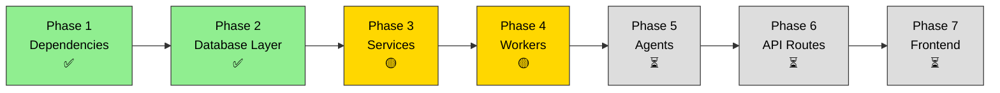
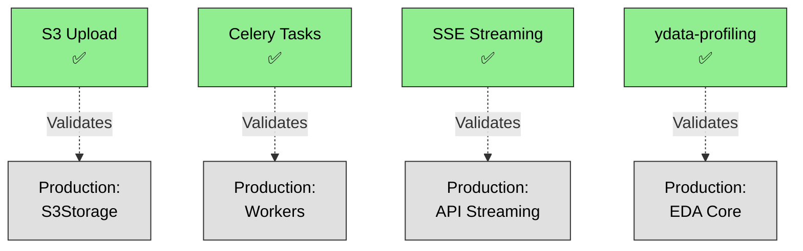
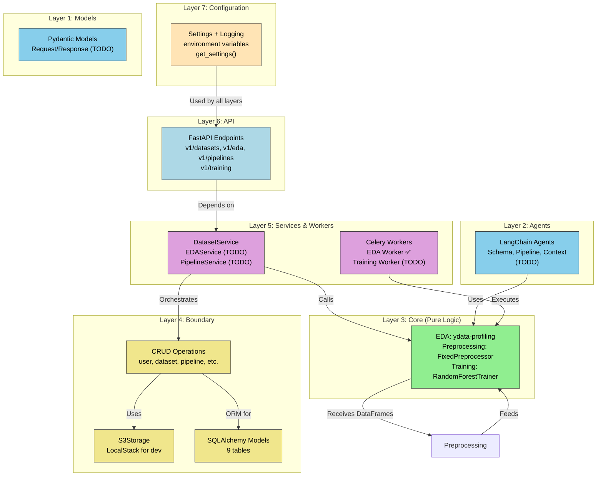
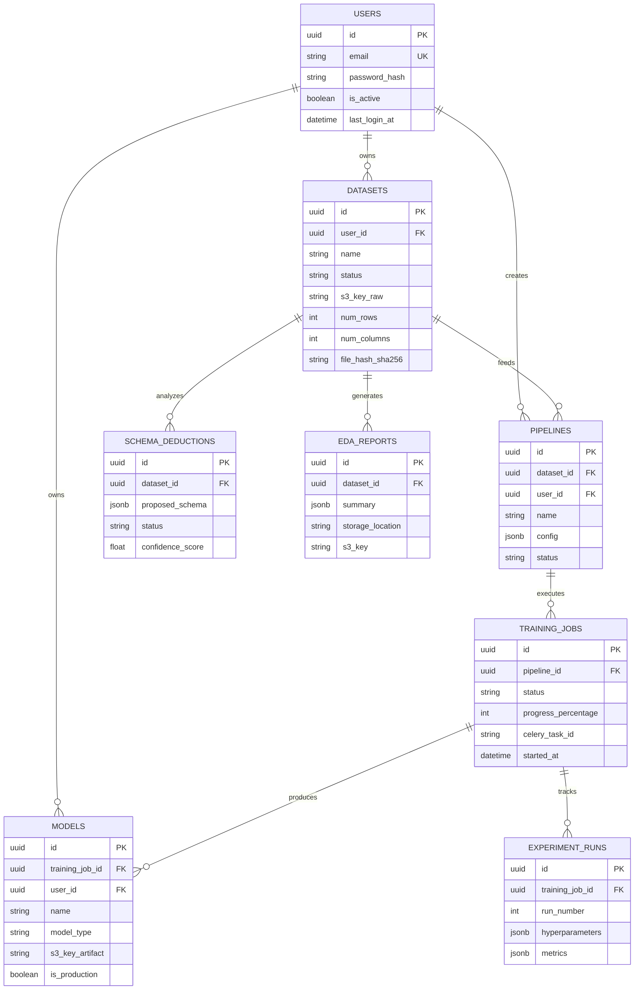

# PipeWeave: Automated ML Pipeline Workbench

**An intelligent ML pipeline generation and training system powered by LangChain agents and Google Gemini.**

> 🚀 **Status:** Phase 2 Complete - Database Layer, Configuration, Core EDA, Preprocessing, and Training modules ready. **See [Built vs. TODO](#whats-built-vs-todo) for details.**

---

## 📋 Quick Navigation

| What | Where | Status |
|------|-------|--------|
| **API Reference** | [backend/api/](./backend/api/) | ✅ Complete |
| **Database Schema** | [backend/boundary/](./backend/boundary/) | ✅ Complete |
| **Source Code** | [backend/](./backend/) | 🟡 In Progress |
| **Integration Tests** | [backend/spikes/](./backend/spikes/) | ✅ Validated |

---

## 🎯 What's Built vs TODO

### ✅ COMPLETED (Phase 2)



#### **Layer 7: Configuration** ✅
- [x] Settings loader (Pydantic)
- [x] Environment variable validation
- [x] Structured logging with correlation IDs
- 📍 **File:** [backend/configuration/](./backend/configuration/)

#### **Layer 4: Boundary (I/O Gateway)** ✅
- [x] SQLAlchemy ORM models (9 tables)
- [x] Alembic migrations
- [x] CRUD operations (type-safe, async)
- [x] S3 storage wrapper
- [x] Database connection pooling
- 📍 **File:** [backend/boundary/](./backend/boundary/)

#### **Layer 3: Core Business Logic** 🟡 PARTIAL
- [x] **EDA Module** - Statistical analysis with ydata-profiling
  - 📍 [backend/core/eda/](./backend/core/eda/)
- [x] **Preprocessing** - Column detection + fixed pipeline
  - 📍 [backend/core/preprocessing/](./backend/core/preprocessing/)
- [x] **Training** - Random Forest trainer + metrics
  - 📍 [backend/core/training/](./backend/core/training/)
- 📍 **Status:** Pure logic components, no I/O

#### **Layer 2-3: Services + Workers** 🟡 PARTIAL
- [x] **DatasetService** - Upload workflow orchestration
  - 📍 [backend/services/dataset/](./backend/services/dataset/)
- [x] **EDA Worker** - Celery task for report generation
  - 📍 [backend/workers/tasks/](./backend/workers/tasks/)
- ⏳ **Training Worker** - TODO
- ⏳ **Pipeline Service** - TODO
- ⏳ **EDA Service** - TODO

#### **Integration Validation (Spikes)** ✅


📍 **File:** [backend/spikes/](./backend/spikes/)

---

### ⏳ TODO (Phase 3+)

#### **Layer 6: API Endpoints** ⏳
- [ ] Dataset upload endpoints
- [ ] EDA report generation endpoint
- [ ] Pipeline construction endpoint
- [ ] Training job management endpoint
- [ ] Authentication & authorization

#### **Layer 5: Multi-Agent System** ⏳
- [ ] Schema deduction agent
- [ ] Pipeline optimization agent
- [ ] Context gathering agent
- [ ] Agent configuration loading (YAML)

#### **Remaining Core Modules** ⏳
- [ ] Context gathering (RAG)
- [ ] Pipeline construction (DAG generation)
- [ ] Evaluation module (metrics + visualization)

---

## 🏗️ Architecture



---

## 🚀 Quick Start

### Prerequisites

```bash
# Check Python version (3.11+)
python --version

# Check Docker
docker --version
docker-compose --version

# Install uv if needed
pip install uv
```

### Setup (5 minutes)

```bash
# 1. Install dependencies
uv sync

# 2. Copy environment template
cp .env.example .env

# 3. Edit .env and set GOOGLE_API_KEY
#    (Get from https://ai.google.dev)

# 4. Start Docker services
docker-compose up -d

# 5. Verify services
docker-compose ps

# 6. Run migrations
python -m alembic upgrade head

# 7. Load test data (optional)
python -m backend.scripts.init_test_data

# 8. Start API server
python -m uvicorn backend.api.main:app --reload --host 0.0.0.0 --port 8000
```

**API Available At:**
- 📖 Swagger UI: http://localhost:8000/docs
- 📚 ReDoc: http://localhost:8000/redoc
- ❤️ Health Check: http://localhost:8000/health

---

## 🗂️ Project Structure

```
PipeWeave/
├── backend/
│   ├── api/                      ← FastAPI endpoints (routes)
│   │   ├── main.py              ← App factory + middleware
│   │   ├── dependencies.py       ← Dependency injection
│   │   ├── middleware/           ← Request/response middleware
│   │   ├── schemas/              ← Pydantic models
│   │   └── v1/                   ← API v1 routes
│   │
│   ├── boundary/                 ← Database + Storage (Layer 4)
│   │   ├── models/               ← SQLAlchemy ORM (9 models)
│   │   ├── crud/                 ← CRUD operations (8 instances)
│   │   └── storage/              ← S3 wrapper
│   │
│   ├── core/                     ← Domain logic (Layer 3)
│   │   ├── eda/                  ← EDA (profilers/, helpers/) ✅
│   │   ├── preprocessing/        ← Preprocessing (detectors/, pipeline_processors/) ✅
│   │   ├── training/             ← Training (trainers/, metrics/) ✅
│   │   ├── pipeline_construction/← Pipeline (builders/, validators/) ✅
│   │   ├── context_gathering/    ← RAG & profiling (TODO)
│   │   └── evaluation/           ← Evaluation (evaluators/, analyzers/) (TODO)
│   │
│   ├── configuration/            ← Settings & logging (Layer 7) ✅
│   │   ├── settings.py          ← Pydantic Settings
│   │   └── logging.py           ← Structured logging
│   │
│   ├── services/                 ← Business logic orchestration
│   │   ├── dataset/              ← Dataset upload workflow ✅
│   │   ├── eda/                  ← EDA service (TODO)
│   │   └── training/             ← Training service (TODO)
│   │
│   ├── workers/                  ← Celery async tasks
│   │   ├── config/               ← Celery configuration ✅
│   │   └── tasks/                ← Task implementations (EDA ✅, Training TODO)
│   │
│   ├── agents/                   ← LangChain agents (TODO)
│   │   └── configuration/        ← YAML agent configs (TODO)
│   │
│   ├── models/                   ← Pydantic domain models (TODO)
│   │
│   └── spikes/                   ← Integration validation scripts ✅
│       ├── spike_s3_integration.py
│       ├── spike_celery_integration.py
│       ├── spike_sse_server.py & spike_sse_client.py
│       └── spike_ydata_profiling.py
│
├── alembic/                      ← Database migrations
│   └── versions/                 ← Migration scripts
│
├── tests/                        ← Test suite (TODO)
│   ├── unit/                     ← Unit tests with mocks
│   └── integration/              ← Integration tests with real DB
│
├── docker-compose.yml            ← Local services (PostgreSQL, Redis, LocalStack)
├── alembic.ini                   ← Migration config
├── pyproject.toml                ← Dependencies & metadata
├── .env.example                  ← Environment template
└── README.md                     ← This file
```

---

## 📊 Database Schema




---

## 🔧 Development Workflow

### Code Quality

```bash
# Format code
python -m black backend/

# Lint code
python -m ruff check backend/

# Type checking
python -m mypy backend/

# Run all checks
python -m black backend/ && python -m ruff check backend/ && python -m mypy backend/
```

### Testing

```bash
# Run all tests
python -m pytest tests/

# With coverage
python -m pytest tests/ --cov=backend --cov-report=html

# Specific test file
python -m pytest tests/unit/core/eda/test_profiler.py -v
```

### Database Migrations

```bash
# Create new migration (auto-detect changes)
python -m alembic revision --autogenerate -m "Add new table"

# Apply migrations
python -m alembic upgrade head

# Rollback one migration
python -m alembic downgrade -1

# View migration status
python -m alembic current
python -m alembic history
```

### Running Celery Workers (for async tasks)

```bash
# Terminal 1: Start Redis
docker-compose up -d redis

# Terminal 2: Start EDA worker
celery -A backend.workers.celery_app worker --loglevel=info --queue=eda

# Terminal 3: Start training worker (TODO)
celery -A backend.workers.celery_app worker --loglevel=info --queue=training

# Monitor tasks
celery -A backend.workers.celery_app inspect active
celery -A backend.workers.celery_app inspect stats
```

---

## 🧪 Integration Testing (Spikes)

All external service integrations have been validated:

```bash
# Test S3 (LocalStack)
python -m backend.spikes.spike_s3_integration
# Expected: ✅ All 4 tests passed

# Test Celery + Redis
#   Terminal 1: celery -A backend.spikes.celery_app worker --loglevel=info
#   Terminal 2:
python -m backend.spikes.spike_celery_integration
# Expected: ✅ All tests passed

# Test Server-Sent Events (SSE)
#   Terminal 1: python -m uvicorn backend.spikes.spike_sse_server:app --port 8001
#   Terminal 2:
python -m backend.spikes.spike_sse_client
# Expected: ✅ All tests passed, <100ms latency

# Test ydata-profiling performance
python -m backend.spikes.spike_ydata_profiling
# Expected: ✅ All performance budgets met
```

---

## 🔌 Service Integrations

| Service | Port | Status | Notes |
|---------|------|--------|-------|
| **FastAPI** | 8000 | ✅ Ready | Docs at /docs |
| **PostgreSQL** | 5432 | ✅ Ready | Via docker-compose |
| **Redis** | 6379 | ✅ Ready | Celery broker + cache |
| **LocalStack S3** | 4566 | ✅ Ready | S3 emulation for dev |
| **pgAdmin** | 5050 | ✅ Ready | Optional, login: admin@pipeweave.local |

---

## 📚 Key Modules Reference

### Layer 3: Core Business Logic

| Module | Purpose | Directory | Status |
|--------|---------|-----------|--------|
| **EDA** | Statistical analysis | [backend/core/eda/](./backend/core/eda/) | ✅ |
| **Preprocessing** | Column detection + pipeline | [backend/core/preprocessing/](./backend/core/preprocessing/) | ✅ |
| **Training** | Random Forest trainer | [backend/core/training/](./backend/core/training/) | ✅ |
| **Context** | RAG + profiling | [backend/core/context_gathering/](./backend/core/context_gathering/) | ⏳ TODO |
| **Evaluation** | Metrics + visualization | [backend/core/evaluation/](./backend/core/evaluation/) | ⏳ TODO |

**Key Principle:** Core modules contain PURE LOGIC with NO I/O operations.

### Layer 4: Boundary (Database + Storage)

| Component | Purpose | Reference |
|-----------|---------|-----------|
| **Models** | SQLAlchemy ORM (9 tables) | [backend/boundary/models/](./backend/boundary/models/) |
| **CRUD** | Type-safe async operations | [backend/boundary/crud/](./backend/boundary/crud/) |
| **S3Storage** | Presigned URLs, upload/download | [backend/boundary/storage/](./backend/boundary/storage/) |
| **Migrations** | Alembic schema changes | [alembic/versions/](./alembic/versions/) |

### Layer 2-3: Services + Workers

| Service | Purpose | Lines | Status |
|---------|---------|-------|--------|
| **DatasetService** | Upload workflow | [backend/services/dataset/](./backend/services/dataset/) | ✅ |
| **EDA Worker** | Async EDA generation | [backend/workers/tasks/](./backend/workers/tasks/) | ✅ |
| **Training Worker** | Async model training | [backend/workers/tasks/](./backend/workers/tasks/) | ⏳ TODO |

---

## 🔐 Security & Configuration

### Environment Variables

**Required:**
```bash
GOOGLE_API_KEY=your_gemini_api_key_here
SECRET_KEY=your-secret-key-min-32-chars
JWT_SECRET_KEY=your-jwt-secret-min-32-chars
```

**Optional (defaults provided):**
```bash
DATABASE_URL=postgresql+asyncpg://...
REDIS_URL=redis://...
S3_ENDPOINT_URL=http://localhost:4566  # LocalStack
```

📍 **Template:** [.env.example](./.env.example)
📍 **Configuration:** [backend/configuration/](./backend/configuration/)

### CORS Configuration

**Development (default):**
- `http://localhost:3000` (React)
- `http://localhost:5173` (Vite)

**Production:** Update `CORS_ORIGINS` in `.env`

---

## 📖 Documentation

| Document | Purpose |
|----------|---------|
| **Architecture** | Main design decisions and patterns |
| **[backend/api/](./backend/api/)** | FastAPI endpoints and schemas |
| **[backend/boundary/](./backend/boundary/)** | Database schema + CRUD operations |
| **[backend/configuration/](./backend/configuration/)** | Settings + logging configuration |
| **[backend/core/](./backend/core/)** | Core modules (EDA, Preprocessing, Training, etc.) |
| **[backend/services/](./backend/services/)** | Services layer (Dataset, EDA, Training) |
| **[backend/workers/](./backend/workers/)** | Workers + Celery async tasks |
| **[backend/spikes/](./backend/spikes/)** | Integration validation scripts |

---

## 💡 Common Tasks

### Add a New API Endpoint

1. Create Pydantic schema in `backend/api/schemas/`
2. Add endpoint function in `backend/api/v1/<domain>.py`
3. Use dependency injection for DB session
4. Call service layer, not core directly

### Add a New Core Module

1. Create directory under `backend/core/<module_name>/`
2. Add `__init__.py`, `models.py`, main module file
3. Keep files <150 lines (STRICT)
4. No I/O operations (use boundary layer)
5. Organize concrete implementations in subdirectories

### Run a Celery Task

```python
from backend.workers.eda_worker import generate_eda_report

# Async task
task = generate_eda_report.delay(dataset_id=uuid)
print(task.id)  # Get task ID
print(task.status)  # "PENDING", "PROGRESS", "SUCCESS", "FAILURE"
```

### Query the Database

```python
from backend.boundary.crud import dataset_crud
from backend.configuration.settings import get_settings
from sqlalchemy.ext.asyncio import create_async_engine, AsyncSession

async def get_user_datasets(user_id: UUID):
    settings = get_settings()
    async with AsyncSession(engine) as db:
        datasets = await dataset_crud.get_by_user(db, user_id=user_id)
        return datasets
```

---

## ⚠️ Constraints (STRICT)

| Constraint | Reason | How to Check |
|-----------|--------|--------------|
| **Max 150 lines per file** | Encourages modularity | `wc -l backend/**/*.py` |
| **100% type hints** | Catch bugs early | `mypy backend/` |
| **SOLID principles** | Maintainability | Code review |
| **No I/O in core/** | Testability | Imports audit |
| **Module Organization** | Consistent structure | Clear hierarchy |

---

## 🚦 Next Steps

### Immediate (Week 1)
- [ ] Set `GOOGLE_API_KEY` in `.env`
- [ ] Run `uv sync` to install dependencies
- [ ] Start Docker services: `docker-compose up -d`
- [ ] Run migrations: `python -m alembic upgrade head`
- [ ] Start API: `python -m uvicorn backend.api.main:app --reload`
- [ ] Visit http://localhost:8000/docs to explore API

### Short Term (Week 2)
- [ ] Implement missing API endpoints (datasets, EDA, pipelines, training)
- [ ] Build training_worker.py for async model training
- [ ] Create EDAService orchestration layer
- [ ] Add tests for core modules

### Medium Term (Weeks 3-4)
- [ ] Implement LangChain agents
- [ ] Build pipeline construction DAG
- [ ] Implement context gathering (RAG)
- [ ] Add frontend UI (React/Vite)

---

## 🤝 Contributing

1. **Before making changes:**
   - Review main architecture guide
   - Follow 150-line file size limit
   - Review module structure and patterns

2. **When adding code:**
   - Add type hints (100% coverage)
   - Write docstrings (Google style)
   - Keep files focused (one job per file)
   - Organize implementations in subdirectories

3. **Before committing:**
   - Run: `python -m black backend/`
   - Run: `python -m ruff check backend/`
   - Run: `python -m mypy backend/`
   - Run: `python -m pytest tests/`

4. **Commit message format:**
   ```
   [MODULE] Short description

   - Detail 1
   - Detail 2
   ```

---

## 📞 Support

- **API Questions:** See [backend/api/](./backend/api/)
- **Database Questions:** See [backend/boundary/](./backend/boundary/)
- **Module Issues:** Check relevant module directory
- **General Architecture:** Review root directory files

---

## 📄 License

MIT

---

**Last Updated:** 2025-12-28
**Current Phase:** Phase 2 Complete (Database + Configuration + Core Modules)
**Contributors:** Built with clean architecture, SOLID principles, and comprehensive documentation.
