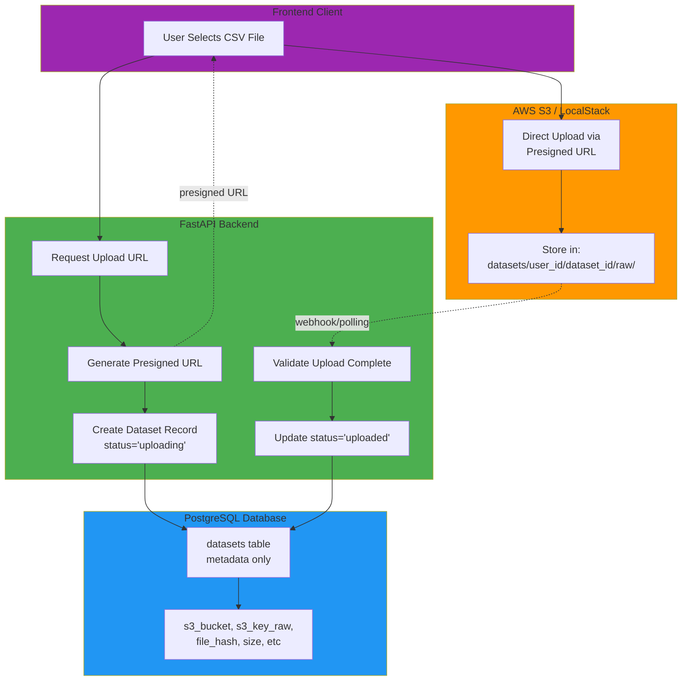
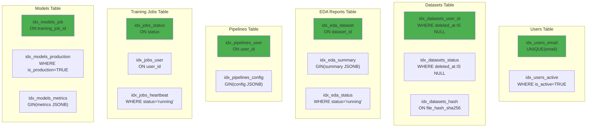
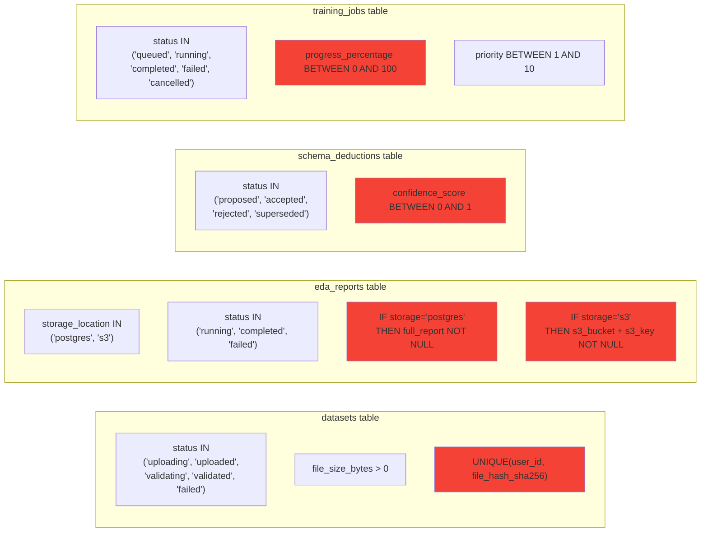
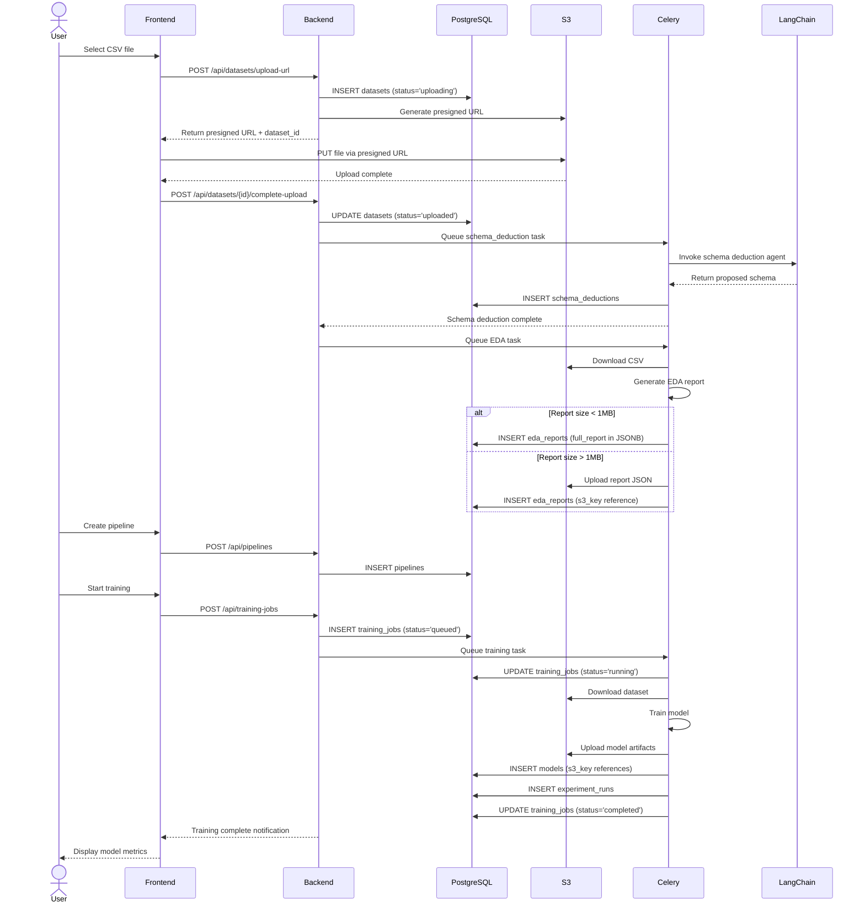
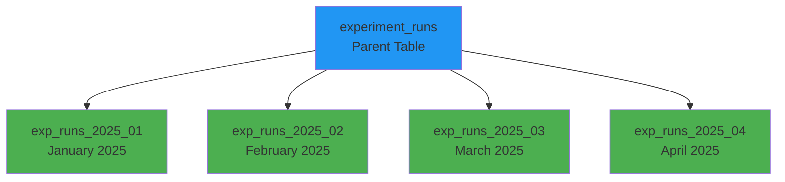

# PipeWeave Database Entity-Relationship Diagram

**Created:** 2025-12-27
**Purpose:** Complete visual schema design for PostgreSQL database with S3 storage references
**Status:** Phase 2 - Schema Design

---

## Complete ERD Diagram

```mermaid
erDiagram
    users ||--o{ datasets : owns
    users ||--o{ pipelines : creates
    users ||--o{ models : owns
    users ||--o{ eda_reports : owns

    datasets ||--o{ schema_deductions : has
    datasets ||--o{ eda_reports : generates
    datasets ||--o{ pipelines : uses

    pipelines ||--o{ training_jobs : runs

    training_jobs ||--o{ models : produces
    training_jobs ||--o{ experiment_runs : tracks

    users {
        uuid id PK
        string email UK "UNIQUE, lowercase normalized"
        string password_hash "bcrypt hashed"
        string full_name
        boolean is_active "default TRUE"
        boolean is_superuser "default FALSE"
        timestamp last_login_at "nullable"
        integer failed_login_count "default 0"
        timestamp locked_until "nullable"
        timestamp password_changed_at "nullable"
        timestamp created_at "default NOW()"
        timestamp updated_at "default NOW()"
        timestamp deleted_at "soft delete, nullable"
    }

    datasets {
        uuid id PK
        uuid user_id FK "REFERENCES users(id)"
        string name "NOT NULL"
        text description "nullable"
        string s3_bucket "S3 reference"
        string s3_key_raw "path to raw CSV in S3"
        string s3_key_processed "path to Parquet, nullable"
        bigint file_size_bytes "NOT NULL"
        string file_hash_sha256 "SHA-256 for deduplication"
        string content_type "default text/csv"
        bigint num_rows "nullable, populated after validation"
        integer num_columns "nullable"
        array column_names "TEXT[], quick preview"
        string status "uploading|uploaded|validating|validated|failed"
        jsonb validation_errors "nullable"
        timestamp created_at "default NOW()"
        timestamp updated_at "default NOW()"
        timestamp deleted_at "soft delete, nullable"
    }

    schema_deductions {
        uuid id PK
        uuid dataset_id FK "REFERENCES datasets(id) CASCADE"
        uuid user_id FK "REFERENCES users(id)"
        jsonb proposed_schema "column types, formats"
        jsonb column_metadata "sample values, confidence scores"
        string status "proposed|accepted|rejected|superseded"
        float confidence_score "0.0 to 1.0"
        string agent_version "LangChain agent version"
        text rejection_reason "nullable, if rejected"
        timestamp created_at "default NOW()"
        timestamp updated_at "default NOW()"
    }

    eda_reports {
        uuid id PK
        uuid dataset_id FK "REFERENCES datasets(id) CASCADE"
        uuid user_id FK "REFERENCES users(id)"
        jsonb summary "always in PG: rows, cols, missing%, dtypes"
        bigint report_size_bytes "size of full report"
        string storage_location "postgres|s3"
        jsonb full_report "nullable, if size < 1MB"
        string s3_bucket "nullable, if size > 1MB"
        string s3_key "nullable, path to report JSON in S3"
        string report_version "schema version for compatibility"
        float generation_time_seconds "nullable"
        string status "running|completed|failed"
        text error_message "nullable"
        timestamp created_at "default NOW()"
        timestamp updated_at "default NOW()"
    }

    pipelines {
        uuid id PK
        uuid user_id FK "REFERENCES users(id)"
        uuid dataset_id FK "REFERENCES datasets(id) RESTRICT"
        string name "NOT NULL"
        text description "nullable"
        jsonb config "full pipeline DAG configuration"
        jsonb node_registry "valid node IDs and types"
        integer version "auto-increment per user"
        string status "draft|validated|archived"
        timestamp validated_at "nullable"
        timestamp created_at "default NOW()"
        timestamp updated_at "default NOW()"
        timestamp deleted_at "soft delete, nullable"
    }

    training_jobs {
        uuid id PK
        uuid pipeline_id FK "REFERENCES pipelines(id) CASCADE"
        uuid user_id FK "REFERENCES users(id)"
        uuid dataset_id FK "REFERENCES datasets(id)"
        jsonb pipeline_snapshot "immutable copy of pipeline config"
        string status "queued|running|completed|failed|cancelled"
        integer progress_percentage "0 to 100"
        text current_step "nullable, e.g. 'Training XGBoost'"
        timestamp started_at "nullable"
        timestamp completed_at "nullable"
        timestamp heartbeat_at "last worker ping"
        float training_duration_seconds "nullable"
        string celery_task_id "Celery task UUID"
        integer priority "default 5, higher = more urgent"
        text error_message "nullable"
        jsonb error_traceback "nullable"
        timestamp created_at "default NOW()"
        timestamp updated_at "default NOW()"
    }

    models {
        uuid id PK
        uuid training_job_id FK "REFERENCES training_jobs(id) RESTRICT"
        uuid pipeline_id FK "REFERENCES pipelines(id)"
        uuid user_id FK "REFERENCES users(id)"
        string name "NOT NULL"
        string model_type "xgboost|random_forest|logistic_regression|etc"
        string framework_version "e.g. scikit-learn==1.3.0"
        string s3_bucket "S3 reference for model artifacts"
        string s3_key_artifact "path to model.pkl or model.joblib"
        string s3_key_config "nullable, path to model_config.json"
        string s3_key_metadata "nullable, path to feature_importance.json"
        bigint artifact_size_bytes "size of model file"
        string artifact_checksum "SHA-256 for integrity"
        jsonb metrics "performance metrics: accuracy, f1, etc"
        integer version "auto-increment per pipeline"
        boolean is_production "default FALSE"
        timestamp deployed_at "nullable"
        timestamp created_at "default NOW()"
        timestamp updated_at "default NOW()"
    }

    experiment_runs {
        uuid id PK
        uuid training_job_id FK "REFERENCES training_jobs(id) CASCADE"
        uuid user_id FK "REFERENCES users(id)"
        integer run_number "sequential run number for this job"
        jsonb hyperparameters "parameters used in this run"
        jsonb metrics "detailed metrics for this run"
        float training_time_seconds "duration of this run"
        string status "running|completed|failed"
        timestamp created_at "default NOW()"
        timestamp updated_at "default NOW()"
    }
```



---

## Storage Flow Diagram



---

## Table Relationships Summary

### Primary Relationships

| Parent Table | Child Table | Relationship | Delete Strategy | Reason |
|--------------|-------------|--------------|-----------------|---------|
| users | datasets | 1:N | RESTRICT | User must explicitly delete datasets |
| users | pipelines | 1:N | RESTRICT | Pipelines may be templates |
| users | models | 1:N | RESTRICT | Models are valuable assets |
| datasets | schema_deductions | 1:N | CASCADE | Metadata tied to dataset |
| datasets | eda_reports | 1:N | CASCADE | Reports meaningless without dataset |
| datasets | pipelines | 1:N | RESTRICT | Pipelines may reference multiple datasets |
| pipelines | training_jobs | 1:N | CASCADE | Jobs tied to specific pipeline |
| training_jobs | models | 1:N | RESTRICT | Models persist after job deletion |
| training_jobs | experiment_runs | 1:N | CASCADE | Runs are job metadata |

---

## Indexes Strategy

### High-Priority Indexes (Query Performance)



---

## Constraints & Validations

### Check Constraints



---

## S3 Key Naming Conventions

### Datasets Storage Pattern

```
s3://pipeweave-storage/
└── datasets/
    └── {user_id}/
        └── {dataset_id}/
            ├── raw/
            │   └── {upload_timestamp}.csv
            └── processed/
                └── {version}.parquet
```

**Example:**
```
s3://pipeweave-storage/datasets/
  550e8400-e29b-41d4-a716-446655440000/
    7c9e6679-7425-40de-944b-e07fc1f90ae7/
      raw/2025-12-27T14-30-00Z.csv
      processed/v1.parquet
```

---

### Models Storage Pattern

```
s3://pipeweave-storage/
└── models/
    └── {user_id}/
        └── {model_id}/
            ├── artifacts/
            │   ├── model.pkl
            │   ├── model.joblib
            │   └── model_config.json
            ├── checkpoints/
            │   ├── epoch_001.ckpt
            │   └── epoch_002.ckpt
            └── metadata/
                ├── feature_importance.json
                └── training_history.json
```

**Example:**
```
s3://pipeweave-storage/models/
  550e8400-e29b-41d4-a716-446655440000/
    abc12345-6789-4def-0123-456789abcdef/
      artifacts/model.pkl
      metadata/feature_importance.json
```

---

### EDA Reports Storage Pattern (Large Reports Only)

```
s3://pipeweave-storage/
└── datasets/
    └── {user_id}/
        └── {dataset_id}/
            └── metadata/
                └── eda_report_{timestamp}.json
```

**Example:**
```
s3://pipeweave-storage/datasets/
  550e8400-e29b-41d4-a716-446655440000/
    7c9e6679-7425-40de-944b-e07fc1f90ae7/
      metadata/eda_report_2025-12-27T14-35-00Z.json
```

---

## Data Flow: CSV Upload to Model Training



---

## Table Size Projections (1 Year, 1000 Users)

| Table | Estimated Rows | Avg Row Size | Total Size | Growth Rate |
|-------|----------------|--------------|------------|-------------|
| users | 1,000 | 500 bytes | 500 KB | Low |
| datasets | 10,000 | 1 KB | 10 MB | Medium |
| schema_deductions | 10,000 | 5 KB | 50 MB | Medium |
| eda_reports | 10,000 | 2 KB (summary only) | 20 MB | Medium |
| pipelines | 50,000 | 10 KB | 500 MB | High |
| training_jobs | 200,000 | 2 KB | 400 MB | High |
| models | 200,000 | 1 KB (metadata only) | 200 MB | High |
| experiment_runs | 2,000,000 | 1 KB | 2 GB | Very High |
| **TOTAL (PostgreSQL)** | | | **~3.2 GB** | |
| **S3 Storage (Blobs)** | | | **~10 TB** | |

**Notes:**
- PostgreSQL stays lean (<5GB) with only metadata
- Bulk data (CSVs, models) scales independently in S3
- `experiment_runs` is largest table → partition by `created_at` after 1M rows

---

## Partitioning Strategy (Future Optimization)

### Partition `experiment_runs` by Month



**Trigger:** When `experiment_runs` exceeds 1 million rows

**Benefits:**
- Faster queries (scan only relevant partitions)
- Easier archival (drop old partitions)
- Better vacuum performance

---

## Next Steps

1. Review ERD diagram for correctness
2. Implement SQLAlchemy models based on this design
3. Create Alembic migrations
4. Set up indexes and constraints
5. Write integration tests for relationships

---

**Status:** ERD Design Complete ✅
**Ready for:** SQLAlchemy Model Implementation
