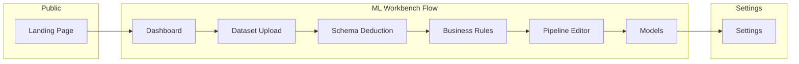
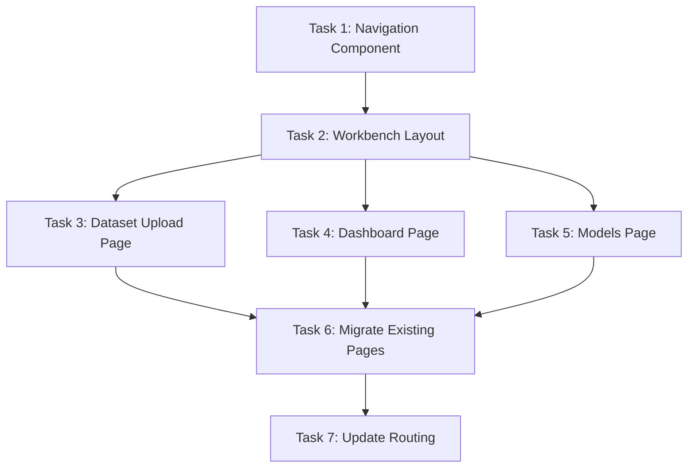

# Navigation Unification & Dataset Upload Page Plan

## Overview

**Goal:** Unify the fragmented navigation system across 5+ pages into a single, cohesive sidebar component following the ML Workbench sequential workflow pattern.

**Current State:**
- 3 different NavigationRail implementations (Schema, Business Rules, Pipeline Editor)
- 1 MainLayout Sidebar (unused by workbench pages)
- 4 missing pages (Dashboard, Datasets, Pipelines, Models)
- No dataset upload page

---

## Architecture: Sequential ML Workbench Flow



---

## Task Breakdown (7 Modular Tasks)

### Task 1: Unified Navigation Component
**Agent:** frontend-architect
**Output:** `src/components/navigation/`

Create a single, reusable navigation sidebar that:
- Supports both collapsed (icon-only) and expanded states
- Shows sequential workflow progress (steps 1-6)
- Has consistent styling across all workbench pages
- Supports active, completed, and locked states for steps

**Files to create:**
```
src/components/navigation/
├── WorkbenchSidebar.tsx      # Main sidebar component
├── NavItem.tsx               # Individual nav item with states
├── WorkflowProgress.tsx      # Visual progress indicator
├── navigation.config.ts      # Centralized nav items config
└── index.ts                  # Barrel export
```

**Props Interface:**
```typescript
interface WorkbenchSidebarProps {
  currentStep: WorkflowStep;
  completedSteps: WorkflowStep[];
  projectId?: string;
  isCollapsed?: boolean;
  onToggleCollapse?: () => void;
}

type WorkflowStep =
  | 'dashboard'
  | 'dataset'
  | 'schema'
  | 'business-rules'
  | 'pipeline'
  | 'models';
```

---

### Task 2: Unified Workbench Layout
**Agent:** frontend-architect
**Output:** `src/components/layouts/WorkbenchLayout.tsx`

Create a layout wrapper that:
- Wraps all workbench pages (not landing)
- Includes unified sidebar
- Manages sidebar collapse state
- Provides consistent page structure

**Structure:**
```
┌────────────────────────────────────────────────┐
│ WorkbenchLayout                                 │
├────────┬───────────────────────────────────────┤
│        │ Header (breadcrumb + actions)         │
│ Sidebar├───────────────────────────────────────┤
│  64px  │                                       │
│   or   │  Page Content (<Outlet />)            │
│  240px │                                       │
│        │                                       │
└────────┴───────────────────────────────────────┘
```

---

### Task 3: Dataset Upload Page
**Agent:** frontend-architect
**Output:** `src/pages/DatasetUploadPage.tsx`, `src/components/dataset-upload/`

Create a professional dataset upload page with:
- Drag & drop file upload zone
- CSV preview table (first 10 rows)
- File validation (size, format)
- Upload progress indicator
- Basic dataset metadata form (name, description)

**Components:**
```
src/components/dataset-upload/
├── UploadDropzone.tsx        # Drag & drop area
├── FilePreview.tsx           # CSV preview table
├── UploadProgress.tsx        # Progress bar
├── DatasetMetadataForm.tsx   # Name, description inputs
└── index.ts
```

---

### Task 4: Dashboard Page
**Agent:** frontend-architect
**Output:** `src/pages/DashboardPage.tsx`, `src/components/dashboard/`

Create the workbench entry point:
- Recent projects list
- Quick stats (datasets, pipelines, models)
- "New Project" CTA
- Getting started guide for new users

**Components:**
```
src/components/dashboard/
├── RecentProjects.tsx
├── QuickStats.tsx
├── GettingStarted.tsx
└── index.ts
```

---

### Task 5: Models Page
**Agent:** frontend-architect
**Output:** `src/pages/ModelsPage.tsx`, `src/components/models/`

Create the models management page:
- Trained models list with metrics
- Model comparison view
- Download/export options
- Model metadata display

**Components:**
```
src/components/models/
├── ModelCard.tsx
├── ModelsList.tsx
├── ModelMetrics.tsx
└── index.ts
```

---

### Task 6: Migrate Existing Pages to Unified Layout
**Agent:** frontend-architect
**Output:** Updated existing pages

Update these pages to use WorkbenchLayout instead of custom NavigationRails:
- `SchemaDeductionPage.tsx` - Remove internal NavigationRail
- `BusinessRuleInjectionPage.tsx` - Remove internal NavigationRail
- `PipelineEditorPage.tsx` - Remove internal NavigationRail
- `SettingsPage.tsx` - Complete the stub implementation

**Keep:** All page-specific content and functionality
**Remove:** Custom NavigationRail imports and usage
**Add:** WorkbenchLayout wrapper via App.tsx routes

---

### Task 7: Update App.tsx Routing
**Agent:** frontend-architect
**Output:** Updated `src/App.tsx`

Restructure routes:
```tsx
<Routes>
  {/* Public */}
  <Route path="/" element={<LandingPage />} />

  {/* Workbench with unified layout */}
  <Route element={<WorkbenchLayout />}>
    <Route path="/dashboard" element={<DashboardPage />} />
    <Route path="/dataset" element={<DatasetUploadPage />} />
    <Route path="/schema" element={<SchemaDeductionPage />} />
    <Route path="/business-rules" element={<BusinessRuleInjectionPage />} />
    <Route path="/pipeline" element={<PipelineEditorPage />} />
    <Route path="/models" element={<ModelsPage />} />
    <Route path="/settings" element={<SettingsPage />} />
  </Route>
</Routes>
```

---

## Design System Constraints

**Color Palette (Unified):**
```css
--workbench-bg: #0a0a0f;
--workbench-surface: #131022;
--workbench-primary: #3713ec;
--workbench-primary-hover: #4a2aff;
--workbench-text: #ffffff;
--workbench-text-muted: #9b92c9;
--workbench-border: #1e1a36;
--workbench-success: #22c55e;
--workbench-warning: #f59e0b;
```

**Typography:**
- Headings: Inter or system font
- Monospace: JetBrains Mono for code/data

**Animation:**
- Use Framer Motion (not GSAP) for consistency
- Respect prefers-reduced-motion
- Subtle transitions (200-300ms)

**Spacing:**
- Sidebar collapsed: 64px
- Sidebar expanded: 240px
- Page padding: 24px

---

## Execution Order



**Parallel Execution:**
- Tasks 3, 4, 5 can run in parallel (independent pages)
- Task 6 depends on Tasks 2-5
- Task 7 is the final integration step

---

## Success Criteria

1. **Single sidebar** used across all workbench pages
2. **Sequential flow** clearly visible in navigation
3. **Dataset upload page** fully functional
4. **All 4 missing pages** implemented
5. **No duplicate NavigationRail** components
6. **Consistent styling** across all pages
7. **Responsive** - sidebar collapses on mobile

---

## Files to Delete After Migration

```
src/components/schema-deduction/NavigationRail.tsx
src/components/business-rules/NavigationRail.tsx
src/components/pipeline-editor/NavigationRail.tsx
src/components/layouts/Sidebar.tsx (replaced by WorkbenchSidebar)
```

---

**Status:** Plan Ready for Execution
**Last Updated:** 2025-12-29
