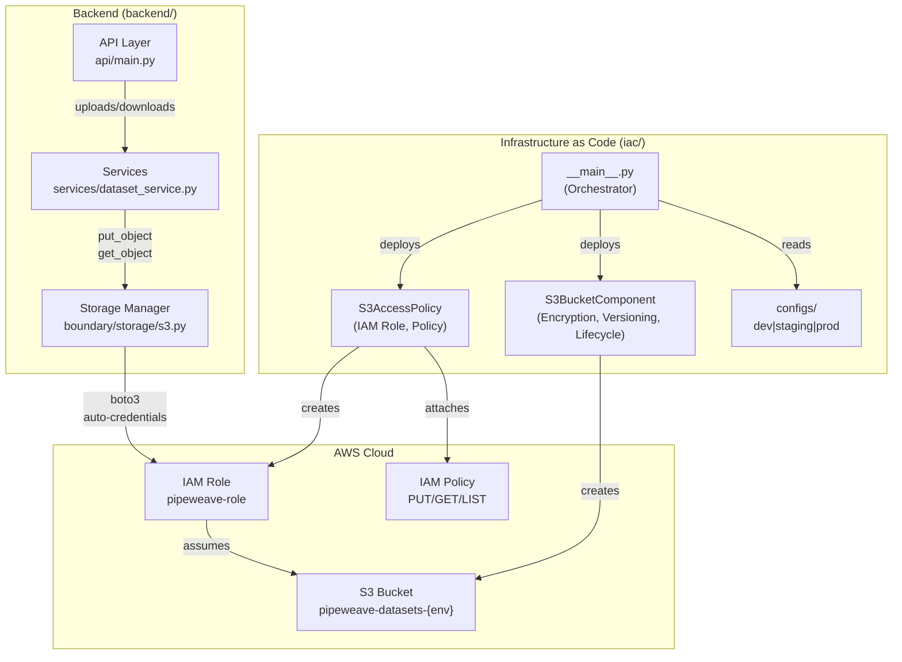

# PipeWeave Infrastructure as Code (IAC)

Pulumi-based infrastructure for managing S3 storage and IAM access policies for PipeWeave datasets.

## Architecture



**How It Works:**
1. Pulumi deploys S3 bucket + IAM role from configuration
2. Backend's S3StorageManager auto-detects IAM role (no hardcoded credentials)
3. IAM policies enforce environment-specific rules (encryption, delete permissions)
4. boto3 client uses attached credentials on EC2/ECS/Lambda

## Directory Structure

```
iac/
├── __main__.py          # Main Pulumi stack orchestrator
├── Pulumi.yaml          # Pulumi project configuration
├── requirements.txt     # Python dependencies
├── README.md            # This file
├── components/
│   ├── __init__.py
│   ├── s3_bucket.py     # S3 bucket component with encryption & lifecycle
│   └── iam_policies.py  # IAM role and policy component
└── configs/
    ├── development.yaml # Dev environment config (permissive)
    ├── staging.yaml     # Staging environment config (balanced)
    └── production.yaml  # Production environment config (strict)
```

## Components

### S3BucketComponent (`components/s3_bucket.py`)
Creates and configures an S3 bucket with:
- **Versioning**: Enabled for data protection and recovery
- **Encryption**: Server-side AES-256 encryption
- **Public Access Block**: Prevents accidental public exposure
- **Lifecycle Rules**: Automatic archival to GLACIER after N days

### S3AccessPolicy (`components/iam_policies.py`)
Manages access control via:
- **IAM Role**: Assumable by EC2, ECS, Lambda
- **IAM Policy**: Granular permissions for S3 operations
- **Encryption Enforcement**: Requires SSE-AES256 for uploads
- **Instance Profile**: Ready for EC2 attachment

## Environment Configurations

### Development (`configs/development.yaml`)
- **Bucket**: `pipeweave-datasets-development-{stack}`
- **Versioning**: Enabled
- **Encryption**: Enabled
- **Lifecycle**: Disabled (keep all versions)
- **IAM**: Allow PUT, GET, DELETE (no encryption requirement)
- **Use Case**: Local development, testing, cleanup

### Staging (`configs/staging.yaml`)
- **Bucket**: `pipeweave-datasets-staging-{stack}`
- **Versioning**: Enabled
- **Encryption**: Enabled
- **Lifecycle**: Enabled (GLACIER after 60 days)
- **IAM**: Allow PUT, GET, DELETE (with encryption required)
- **Use Case**: Pre-production validation, realistic testing

### Production (`configs/production.yaml`)
- **Bucket**: `pipeweave-datasets-production-{stack}`
- **Versioning**: Enabled
- **Encryption**: Enabled (enforced)
- **Lifecycle**: Enabled (GLACIER after 90 days, compliance archival)
- **IAM**: Allow PUT, GET only (DELETE disabled)
- **Use Case**: Customer data, compliance, disaster recovery

## Setup Instructions

### Prerequisites
- Python 3.9+
- AWS CLI configured with credentials
- Pulumi CLI installed: https://www.pulumi.com/docs/install/

### Installation

```bash
# 1. Install Python dependencies
pip install -r requirements.txt

# 2. Create stacks for each environment
pulumi stack init development
pulumi stack init staging
pulumi stack init production

# 3. Set AWS region (optional, default: us-east-1)
pulumi config set aws:region us-west-2  # for each stack
```

## Deployment

### Deploy Development Stack

```bash
# Select stack
pulumi stack select development

# Preview changes
pulumi preview

# Deploy
pulumi up
```

### Deploy Staging Stack

```bash
pulumi stack select staging
pulumi preview
pulumi up
```

### Deploy Production Stack

```bash
pulumi stack select production
pulumi preview
pulumi up
```

## Stack Outputs

After deployment, retrieve outputs:

```bash
# Show all outputs
pulumi stack output

# Get specific output
pulumi stack output bucket_name
pulumi stack output iam_role_arn
```

Example outputs:
```
bucket_name:           pipeweave-datasets-production-prod
bucket_arn:            arn:aws:s3:::pipeweave-datasets-production-prod
bucket_region:         us-east-1
iam_role_arn:          arn:aws:iam::123456789:role/pipeweave-role
iam_policy_arn:        arn:aws:iam::123456789:policy/pipeweave-policy
instance_profile_arn:  arn:aws:iam::123456789:instance-profile/pipeweave-instance-profile
environment:           production
```

## Integration with Application

### Backend Storage Layer

Update `backend/boundary/storage/s3.py` to use IAM role:

```python
import boto3

# Get role ARN from Pulumi output
role_arn = "arn:aws:iam::123456789:role/pipeweave-role"
session = boto3.Session()
s3_client = session.client("s3")

# S3 client will use the attached IAM credentials
```

### EC2/ECS Attachment

Attach instance profile to compute resources:

```python
# In Terraform or CloudFormation
instance_profile_arn = pulumi.get_stack_output("instance_profile_arn")
```

## AWS IAM Policy Details

### PutObject Permissions
Allows dataset uploads with mandatory encryption:
```json
{
  "Effect": "Allow",
  "Action": "s3:PutObject",
  "Resource": "arn:aws:s3:::bucket/*"
}
```

**Enforced Conditions** (Production/Staging):
- Requires `x-amz-server-side-encryption: AES256`
- Uploads without encryption are denied

### GetObject Permissions
Allows reading datasets:
```json
{
  "Effect": "Allow",
  "Action": "s3:GetObject",
  "Resource": "arn:aws:s3:::bucket/*"
}
```

### ListBucket Permissions
Allows listing objects:
```json
{
  "Effect": "Allow",
  "Action": "s3:ListBucket",
  "Resource": "arn:aws:s3:::bucket"
}
```

### DeleteObject Permissions
- **Development**: Allowed (cleanup in testing)
- **Staging**: Allowed (selective cleanup)
- **Production**: Denied (prevent accidental deletion)

## S3 Bucket Security

### Public Access Block
All four settings enabled:
- `BlockPublicAcls`: Yes
- `BlockPublicPolicy`: Yes
- `IgnorePublicAcls`: Yes
- `RestrictPublicBuckets`: Yes

### Encryption
- **Algorithm**: AES-256 (S3-managed keys)
- **Enforcement**: Required for PUT operations
- **Status**: Enabled for all objects

### Versioning
- Enables rollback capabilities
- Tracks all object versions
- Useful for data recovery

### Lifecycle Policy

**Development**: No lifecycle (keep all versions)

**Staging/Production**:
- Transition to GLACIER after N days (60/90)
- Reduces storage costs for archived data
- Maintains compliance archival

## State Management

Pulumi state is stored by default in:
```
~/.pulumi/stacks/pipeweave-iac/{stack-name}.json
```

For team collaboration, use Pulumi Service backend:
```bash
pulumi login  # Authenticate to Pulumi Service
```

## Cleanup

Destroy a stack:

```bash
pulumi stack select <stack-name>
pulumi destroy
```

**Warning**: This deletes the S3 bucket and all its contents. In production, ensure backups exist.

## Troubleshooting

### "Configuration file not found"
Ensure you're running `pulumi up` from the `iac/` directory.

### "Bucket already exists"
S3 bucket names are globally unique. The stack automatically appends stack name. If collision occurs:
```bash
# Change bucket name in configs/
vim configs/production.yaml  # Modify s3.bucket_name
pulumi up
```

### "Access Denied"
Verify AWS credentials:
```bash
aws sts get-caller-identity
```

IAM user needs permissions:
- s3:CreateBucket
- s3:PutBucketVersioning
- s3:PutBucketEncryption
- iam:CreateRole
- iam:PutRolePolicy

## Cost Optimization

### S3 Costs
- **Lifecycle to GLACIER**: Reduces cost from $0.023/GB to $0.004/GB
- **Versioning**: Stores all versions (factor this into cost)
- **Encryption**: No additional cost

### IAM Costs
- IAM roles and policies are free
- No cost difference between environments

### Estimated Monthly Costs (1TB/month)
- **Development**: $23 (no lifecycle)
- **Staging**: $13 (60-day lifecycle)
- **Production**: $8 (90-day lifecycle + GLACIER)

## References

- [Pulumi AWS S3 Documentation](https://www.pulumi.com/docs/reference/pkg/aws/s3/)
- [AWS S3 Security Best Practices](https://docs.aws.amazon.com/AmazonS3/latest/userguide/security.html)
- [AWS IAM Best Practices](https://docs.aws.amazon.com/IAM/latest/UserGuide/best-practices.html)
- [PipeWeave Storage Layer](../../backend/boundary/storage/)
